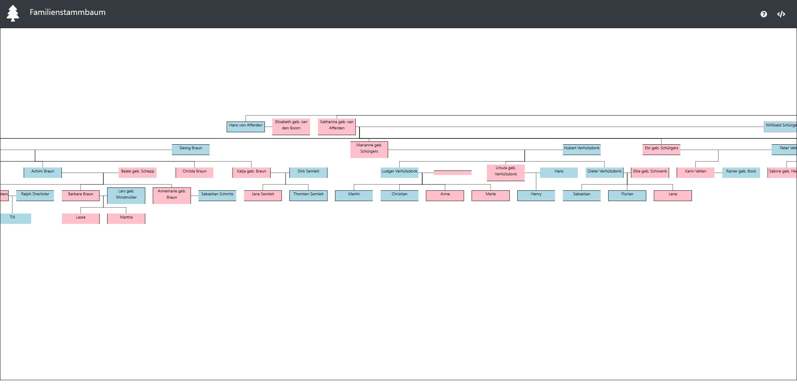

# Familienstammbaum

Darstellung eines Familienstammbaums mit der Möglichkeit zwischen verschiedenen Stammbäumen zu wechseln.

Um Familienstammbäume überschneidungsfrei darzustellen kann nur eine Familienseite verfolgt werden. Das Verfolgen mehrerer Familienseiten in einer Darstellung ohne Überschneidungen ist nicht möglich. 

Auch in dem hier entwickelten Stammbaum ist es nur möglich eine Familienseite darzustellen. Wenn jedoch ausreichend Informationen hinterlegt sind kann zwischen verschiedenen Familienseiten gewechselt werden und ein angepasster Familienstammbaum wird dargestellt. 

## Verwendung

Die für die Darstellung notwendigen Daten sind in der Datei `src/FamilyData.json` gepflegt und persistiert. Es ist zwar möglich zur Laufzeit die Datenbasis anzupassen, jedoch findet keine Persistierung dieser Änderungen statt.

## Technische Details

### Verwendete Komponenten

Im Kern der Anwendung wird die Visualisierungsbibliothek D3 für die Darstellung des Baums genutzt. Darauf aufbauend wurde die Bibliothek dTree von ErikGartner (https://github.com/ErikGartner/dTree) entwickelt. Diese Bibliothek wird auch für die Darstellung in dieser Anwendung genutzt.

Für die Gestaltung der Seite und die Einbettung der Bibliothek wird React verwendet.

### Anpassung der Datenhaltung

Die dTree Bibliothek erwartet eine hierarchischen Datenstruktur als Eingabe. Jedoch ist es nicht möglich Stammbäume mit mehreren Familienseiten in einer Baumstruktur zu pflegen. Für die Pflege solcher Stammbäume ist eine Graph-Datenstruktur notwendig.

Aus diesem Grund habe ich einen Konverter geschrieben der eine definierte Graph-Datenstruktur (siehe `src/FamilyData.json`) und einen selektieren Knoten (ID des Knoten) als Eingabe erwartet und aus diesen Parametern eine Baumstruktur erzeugt. Diese erzeugte Baumstruktur repräsentiert dann den Familienstammbaum des selektierten Knotens.

Der Konverter GraphToDTreeConverter ist als NPM-Package verfügbar: https://www.npmjs.com/package/graphtodtreeconverter

